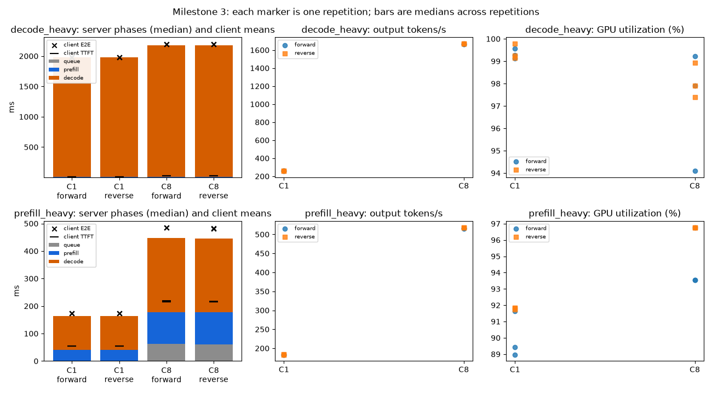

# BottleneckShift Milestone 3 Phase B: prefill-heavy vs decode-heavy regimes

## Result

The pre-registered shift did **not** occur. Decode time dominates end-to-end latency
in both regimes, including `prefill_heavy` (2048 input / 32 output tokens).

Concurrency 8 does change what grows in each regime:

* **`prefill_heavy`:** time before the first token rises from ~31% to ~45% of
  client-observed latency. Server-side queueing appears (~61 ms per request, from
  ~0). TPOT more than doubles, and the inter-token tail widens tenfold (p99 ~45 ms
  vs ~4.5 ms). Output throughput rises only 2.8×.
* **`decode_heavy`** (64 / 512): concurrency 8 is nearly free. Throughput rises 6.5×,
  TPOT rises ~10%, there is no queueing, and decode stays ~99% of server time.

So `prefill_heavy` at C8 moves toward a crossover, with pre-first-token time
approaching parity with decode, but on this model and GPU it does not cross.

## Terms used in this report

| Term | Meaning |
|---|---|
| TTFT | time to first token: from sending a request until its first output token arrives |
| TPOT | time per output token: (E2E − TTFT) / (output tokens − 1) |
| ITL | inter-token latency: the gap between consecutive streamed tokens of one request |
| E2E | end-to-end latency: from sending a request until its last token arrives |
| C1, C8 | maximum client concurrency: at most 1 or 8 requests in flight |
| Forward / reverse | the same conditions run in opposite orders (C1 then C8, or C8 then C1) |
| Series / pair | one server start running all warm-ups and measured runs of a config / the series of one session |
| Warm-up | unmeasured runs before measurement, excluded from analysis |
| Regime | `prefill_heavy` = 2048 input / 32 output tokens; `decode_heavy` = 64 input / 512 output tokens |
| Prefill / decode | processing the prompt to produce the first token / generating the remaining tokens one step at a time |
| Queue time | server-side wait before a request is first scheduled |
| Pre-first-token share | fraction of E2E spent before the first token: client Σ TTFT / Σ E2E; server (queue + prefill) / (queue + inference) |
| Dominant component | pre-first-token if mean queue + prefill > mean decode, else decode |
| p50 / p99 | median / 99th percentile (tail) |
| Chunked prefill | vLLM's default: long prompts are split into chunks that share batch steps with other requests' decodes |

Full definitions: [`docs/glossary.md`](../docs/glossary.md).

## Provenance and protocol

- Series: `milestone3-20261003T180358Z-{prefill_heavy,decode_heavy}-{forward,reverse}`,
  October 3, 2026, 18:03:58–18:50:49 UTC.
- Protocol: [`experiments/milestone3.md`](../experiments/milestone3.md). Phase B was
  pre-registered at 2026-10-03 05:36 UTC (PR #10); the Phase A amendment came with
  PR #11. Regimes, conditions, and predictions are unchanged.
- Commit `969fde5e0a1f32664eb0a80b381b9ded91f8aeda`; manifests report a clean
  worktree.
- Host: Hyperstack RTX A4000 (15,352 MiB), 4 vCPU, 20 GiB RAM, Ubuntu 24.04.3, kernel
  6.14.0-37-generic. The image shipped driver 570.195.03, which was upgraded to
  580.178.04 (CUDA 13.0). This is the same shape as Milestone 2 but a different VM.
- Python 3.12.3; vLLM 0.29.0; PyTorch 2.13.0; transformers 5.18.0.
- Milestone 2 controls, all confirmed in each `server.log`:
  - model and tokenizer pinned to `7ae557604adf67be50417f59c2c2f167def9a775`;
  - prefix caching off;
  - `--generation-config vllm`;
  - greedy sampling;
  - warm-ups of 10 prompts at C1 and C8;
  - `percentile_metrics` including `e2el`;
  - three repetitions;
  - 15 s cooldowns;
  - seed 2027.
- Workloads:

  | Regime | Input tokens | Output tokens | Prompts per run |
  |---|---:|---:|---:|
  | `prefill_heavy` | 2048 | 32 | 100 |
  | `decode_heavy` | 64 | 512 | 50 |

  Conditions were C1 and C8, run in forward and reverse order.
- Instrumentation (Phase A): `/metrics` scrapes before each run and after the server
  settles; `nvidia-smi` every 200 ms; `mpstat -P ALL 1`; request-ID prefixes.

## Validation

`scripts/validate_results.py` passed for each series on the host right after it ran,
and again locally from the transferred archive. The archive SHA-256 was verified
after transfer.

| Check | Result |
|---|---|
| Measured requests | 1,800 (600 per `prefill_heavy` series, 300 per `decode_heavy` series) |
| Warm-up requests | 80 |
| Failures | zero |
| Realized token lengths | exact |
| Server request-count delta | equals the prompt count for every run, including warm-ups |
| GPU telemetry | max gap 0.21 s |
| CPU telemetry | max gap 1.0 s |
| Controls | confirmed in all four server logs; no `ERROR` lines |

Reconstructed E2E latency matches vLLM's own `median_e2el_ms` within 0.001 ms in all
24 measured runs.

## Measurements

*Server phases, client latency, throughput, and GPU utilization per regime and
concurrency. Provenance and regeneration: [`reports/figures/README.md`](figures/README.md).*

Medians across three repetitions, with the repetition range in parentheses. Client
metrics are per-run medians across requests. Server phases are per-run means from
histogram deltas. The pre-first-token share is computed client-side (Σ TTFT / Σ E2E)
and server-side ((queue + prefill) / (queue + inference)).

| Regime | Order | Cond. | TTFT (ms) | TPOT (ms) | E2E (ms) | Output tok/s | Server queue / prefill / decode (ms) | Pre-1st share, client / server | GPU util |
|---|---|---|---:|---:|---:|---:|---:|---:|---:|
| prefill_heavy | fwd | C1 | 54.37 (54.18–54.43) | 3.87 | 174.50 (174.27–174.65) | 183.3 | 0.02 / 40.3 / 122.5 | 0.310 / 0.247 | 89% |
| prefill_heavy | fwd | C8 | 220.59 (219.54–221.89) | 8.33 | 489.18 (489.14–489.35) | 516.0 | 61.8 / 116.6 / 268.9 | 0.448 / 0.399 | 94% |
| prefill_heavy | rev | C1 | 54.29 (53.96–54.32) | 3.88 | 174.27 (174.19–174.64) | 183.5 | 0.01 / 40.1 / 122.6 | 0.309 / 0.247 | 92% |
| prefill_heavy | rev | C8 | 218.82 (218.42–219.56) | 8.35 | 486.83 (486.58–487.14) | 518.4 | 60.7 / 115.9 / 268.0 | 0.448 / 0.397 | 97% |
| decode_heavy | fwd | C1 | 12.82 (12.74–12.84) | 3.86 | 1984.60 (1982.66–1984.76) | 258.3 | 0.01 / 8.6 / 1969.3 | 0.007 / 0.004 | 99% |
| decode_heavy | fwd | C8 | 27.47 (27.44–28.46) | 4.25 | 2196.51 (2195.11–2199.26) | 1667.9 | 0.02 / 13.3 / 2167.6 | 0.013 / 0.006 | 98% |
| decode_heavy | rev | C1 | 12.51 (12.49–12.66) | 3.86 | 1984.57 (1983.30–1984.65) | 258.3 | 0.01 / 8.6 / 1969.4 | 0.006 / 0.004 | 99% |
| decode_heavy | rev | C8 | 27.84 (27.43–29.22) | 4.24 | 2194.66 (2193.47–2194.76) | 1669.7 | 0.02 / 13.4 / 2165.0 | 0.013 / 0.006 | 98% |

Inter-token latency (median across repetitions of each run's p50 / p99):

| Regime | C1 | C8 |
|---|---|---|
| prefill_heavy | 3.92 / 4.45 ms | 4.90 / 45.62 ms |
| decode_heavy | 3.85 / 4.32 ms | 4.24 / 4.88 ms |

## Predicted signatures vs observed

| Prediction | `prefill_heavy`, C1 → C8 | `decode_heavy`, C1 → C8 |
|---|---|---|
| TTFT | rises strongly — **confirmed** (54 → 220 ms, 4.1×) | small absolute rise — **confirmed** (+15 ms) |
| Pre-first-token share of E2E | high at both — **mixed**: 31% → 45% (client); high relative to decode-heavy, but never dominant | low at both — **confirmed** (≤ 1.3%) |
| TPOT / ITL | rises, ITL tail widens — **confirmed** (TPOT 2.15×; ITL p99 4.5 → 45.6 ms) | modest rise, like Milestone 2's +12% — **confirmed** (+10%) |
| Throughput gain | well below ~6.5× — **confirmed** (2.8×) | near or above ~6.5× — **confirmed** (6.46×) |
| Server queue time | rises at C8 — **confirmed** (~0 → 61 ms) | small at both — **confirmed** (≤ 0.02 ms) |
| Server prefill time | dominant component — **not confirmed**: decode (122 / 269 ms) exceeds prefill (40 / 117 ms) | minor — **confirmed** |
| Server decode time | minor — **not confirmed** | dominant — **confirmed** (~99%) |
| GPU utilization | high during prefill bursts — consistent (89–97% mean) | high and steady — **confirmed** (98–99%) |
| Stable: zero errors, exact lengths, E2E reconstruction within 1 ms | **confirmed** | **confirmed** |
| Stable: forward/reverse agreement within repetition ranges | mostly; C8 E2E differs by 0.5% (489.2 vs 486.8 ms) with non-overlapping ranges | **confirmed** |

**The shift being tested** was that the dominant component changes from
pre-first-token time in `prefill_heavy` to decode in `decode_heavy`. It is **not
supported**: decode dominates both. The second half, that concurrency amplifies
different components in each regime, **is supported**:

* in `prefill_heavy`, C8 multiplies queue (~0 → 61 ms), prefill (2.9×) and decode
  (2.2×) time;
* in `decode_heavy`, C8 adds only ~10% to decode time.

## Interpretation

- **Why prefill_heavy is not prefill-dominated.** Prefilling 2048 tokens takes ~40 ms
  on this setup. The 31 decode steps take ~122 ms at C1, so even a 32-token output
  outweighs the prefill. For pre-first-token time to dominate, this model and GPU
  would need a longer input, a shorter output, or more concurrency. Milestone 5's
  factorial is where that boundary can be mapped.
- **The C8 mechanism in prefill_heavy (plausible, not proven).** TPOT doubles and the
  ITL p99 rises to ~45 ms, about the time of one 2048-token prefill (~40 ms at C1).
  Requests also wait ~61 ms in the queue. Together these fit decode steps that stall
  behind other requests' prefills, with the GPU busy on prefill. Utilization (94–97%)
  corroborates heavy use but does not identify the cause. A contention intervention
  (Phase C) is the test.
- **decode_heavy scales almost linearly.** At C1 the GPU is already ~99% utilized, yet
  C8 delivers 6.5× throughput for +10% TPOT. Utilization alone therefore does not
  indicate saturation, which is why the protocol treats it as corroboration only.
- **Client vs server views.**
  - Client TTFT exceeds the server's own TTFT histogram by ~2–4 ms (C1) and ~4.5–5.5 ms
    (C8). This is consistent with HTTP and streaming overhead.
  - Client TTFT exceeds server queue + prefill by more: ~14 ms (prefill_heavy C1),
    ~39 ms (prefill_heavy C8), ~4 ms and ~15 ms (decode_heavy). Part of this gap is
    request processing before the engine's queue timer starts. The larger
    prefill_heavy gap is consistent with tokenizing 2048-token prompts, but that is
    not isolated here.
  - Client and server ITL agree within 0.1 ms.
- **Relation to Milestone 2** (256 / 128 tokens; a different VM). Milestone 2's
  6.52× C8 throughput gain is close to `decode_heavy`'s 6.46×, consistent with that
  workload also being decode-dominated. `prefill_heavy` is the outlier, at 2.8×.

## Related evidence from published research

This section compares the findings from Milestones 1–3 with published work. The
references were checked on October 3, 2026: arXiv identifiers, titles, and first
authors against arXiv, and the claims against abstracts or full text. Most prior work
uses 7B–540B models on A100/H100/TPU hardware. Several compare against an older vLLM
scheduler that prioritized prefill, whereas vLLM 0.29.0 chunks prefills by default.
Magnitudes are therefore not directly comparable; directions and mechanisms are.

| Finding | Verdict | Evidence |
|---|---|---|
| C8 gives ~6.5× throughput for a small TPOT/E2E cost (Milestones 1–2; `decode_heavy`) | **Supports** | Decode is memory-bound, and batching amortizes weight loading [1, 6, 7]. "Batching boosts decode phase throughput immensely but has little effect on prefill throughput" [4, §3.1]. Batching the token phase "yields high throughput without any downside" [6, §III-D]. Iteration-level scheduling is the basis of these gains [2]. |
| TTFT rises with concurrency | **Supports** | Adding decodes to a batch increases TTFT, and TTFT includes a queueing term that grows with load [5, §1, §3.1]. Chunked prefill trades higher TTFT for lower decode stalls [4, §5.4.2]. |
| Prefix caching lowered TTFT (Milestone 1 vs 2) | **Supports the direction** | Reusing a shared prefix removes redundant prefill and lowers first-token latency; higher hit rates give lower latency [1, §4.4; 8, §6.2–6.3]. Our comparison is confounded with sampling and warm-up changes, so only the direction is comparable. |
| Decode dominates E2E even with 2048-token prompts | **Supports** | The generation phase is "responsible for most portion of the latency of a single request" [1, §2.2]. In [6, §III-C], a 1500-token prompt phase takes as long as about 6 output tokens. Here a 2048-token prefill (~40 ms) takes about as long as ~10 decode steps, the same order of magnitude on a much smaller model. |
| `prefill_heavy` C8: TPOT 2.2×, ITL p99 10×, queueing, only 2.8× throughput | **Supports** | Prefills scheduled between decode iterations cause "generation stalls" and P99 time-between-tokens spikes [4, §3.1–3.2]. A waiting prompt can "substantially increase the tail for TBT" [6, §II-D]. Adding a prefill to a decode batch slows both, and chunking alleviates but does not eliminate this [5, §2.3; 3; 9]. The closest setup, vLLM with Qwen3-0.6B on one A100, reports the same interference: long prefills delay active decodes [11]. |
| Strength of that interference on an RTX A4000 | **Qualifies** | Interference cost depends on memory bandwidth. On a 1.79 TB/s GPU it appears once decode tokens exceed 20% of a batch, versus 80% on a 4.8 TB/s H200 [12]. The A4000 has less bandwidth than either, so strong interference is plausible here. That is an inference, not tested in [12]. |
| GPU utilization ~99% at C1, yet throughput still scales 6.5× | **Qualifies / supports in spirit** | Large-batch inference stays memory-bound, and SM activity can be high while warp usage stays low (≤ 35%) [10, §V-A]. That study uses profiler metrics rather than the `nvidia-smi` counter used here, so it supports treating utilization as corroboration only, not as a saturation signal. |
| Client TTFT exceeds server queue + prefill, more for long prompts | **Supports plausibility; no attribution** | CPU starvation and tokenization add to TTFT [13, 14]. A single-process benchmark client can itself inflate TTFT and TPOT under high load [15], which is relevant because client and server share a host here. None of these isolates the vLLM API-server gap for this setup. |

**Taken together:** published results anticipate the decode-dominance and
prefill–decode interference findings. What this study adds is a measured,
pre-registered characterization on a small model and a bandwidth-limited workstation
GPU, with client, server, and telemetry views of the same runs. The negative result,
that `prefill_heavy` did not become prefill-dominated, is consistent with this
literature rather than in tension with it.

**References**

1. W. Kwon et al., "Efficient Memory Management for Large Language Model Serving with PagedAttention," SOSP 2023. https://arxiv.org/abs/2309.06180
2. G.-I. Yu et al., "Orca: A Distributed Serving System for Transformer-Based Generative Models," OSDI 2022. https://www.usenix.org/conference/osdi22/presentation/yu
3. A. Agrawal et al., "SARATHI: Efficient LLM Inference by Piggybacking Decodes with Chunked Prefills," arXiv 2308.16369, 2023. https://arxiv.org/abs/2308.16369
4. A. Agrawal et al., "Taming Throughput-Latency Tradeoff in LLM Inference with Sarathi-Serve," OSDI 2024. https://arxiv.org/abs/2403.02310
5. Y. Zhong et al., "DistServe: Disaggregating Prefill and Decoding for Goodput-optimized Large Language Model Serving," OSDI 2024. https://arxiv.org/abs/2401.09670
6. P. Patel et al., "Splitwise: Efficient Generative LLM Inference Using Phase Splitting," ISCA 2024. https://arxiv.org/abs/2311.18677
7. R. Pope et al., "Efficiently Scaling Transformer Inference," MLSys 2023. https://arxiv.org/abs/2211.05102
8. L. Zheng et al., "SGLang: Efficient Execution of Structured Language Model Programs," NeurIPS 2024. https://arxiv.org/abs/2312.07104
9. C. Hu et al., "Inference without Interference: Disaggregate LLM Inference for Mixed Downstream Workloads," arXiv 2401.11181, 2024. https://arxiv.org/abs/2401.11181
10. P. G. Recasens et al., "Mind the Memory Gap: Unveiling GPU Bottlenecks in Large-Batch LLM Inference," arXiv 2503.08311, 2025. https://arxiv.org/abs/2503.08311
11. G. Agarwal et al., "Decode-Latency Feedback Prefill: A Model-Free Controller and Its Generalization Limits," arXiv 2609.38386, 2026. https://arxiv.org/abs/2609.38386
12. W. Zhang et al., "Threshold-Based Exclusive Batching for LLM Inference," arXiv 2606.00516, 2026. https://arxiv.org/abs/2606.00516
13. E. Chung et al., "Characterizing CPU-Induced Slowdowns in Multi-GPU LLM Inference," arXiv 2603.22774, 2026. https://arxiv.org/abs/2603.22774
14. Z. Zhang et al., "TokTier: Exact Stateful CPU+GPU Tokenization for Agentic LLM Serving," arXiv 2607.29678, 2026. https://arxiv.org/abs/2607.29678
15. A. Chandrasekar et al., "Identifying and Mitigating Systemic Measurement Bias in Production LLM Inference Benchmarks," arXiv 2605.24217, 2026. https://arxiv.org/abs/2605.24217

Venues for references 10–15 are not given. They are cited as arXiv preprints because
no peer-reviewed venue was confirmed.

## Limitations

- **Sampler overhead was not measured.** The optional telemetry-off series was not
  run, so the effect of the 200 ms `nvidia-smi` and 1 s `mpstat` samplers on latency
  is unquantified. The scrapes happen outside the benchmark windows. The samplers'
  overlap with measured requests is the remaining concern.
- Two regimes and two concurrency levels do not locate a crossover point. Each run
  has 50–100 requests, and there are three repetitions on one VM allocation, so the
  findings are descriptive, not statistical generalizations.
- GPU utilization is a 200 ms sampled percentage. Short runs (prefill_heavy C8,
  ~6 s) have ~30 samples, so their means are coarse.
- Forward and reverse ran on the same VM about 10 minutes apart (see execution
  notes); the small prefill_heavy C8 E2E order difference is retained.

## Execution notes

- The lean run plan was used: three host scripts, with no separate shakedown.
- **Setup:**
  - `setup.sh` rebooted twice: its driver check (`nvidia-smi | grep -q` under
    `pipefail`) failed after the first reboot. It was fixed to query the driver
    version directly.
  - The second run overwrote the original driver-install log.
  - On the fresh host, `tests/test_phases.py::test_main_writes_rows_summary_and_figure`
    failed: building matplotlib's font cache called a monkeypatched
    `subprocess.run`. The test was deselected on the host, and the analysis ran
    locally. The test is fixed in this PR.
- **Series 2 preflight failure:** after series 1, the preflight for series 2 failed
  because the port was in use. Sockets in TIME_WAIT, left by the `/metrics` scrapes,
  blocked the probe's bind; no server was running. No measured run was attempted.
  The remaining three series ran under the same pair ID, each after port 8000 was
  clear, so series 2 started ~10.5 minutes after series 1 ended. Each series is
  complete and independent; nothing was spliced. The preflight now uses
  `SO_REUSEADDR`, so TIME_WAIT no longer blocks it but a live listener still fails
  it. This is fixed in this PR, with a test.

## Recommended next step

Write the Phase C addendum in `experiments/milestone3.md` and commit it before any
Phase C data. The data point to `prefill_heavy` at C8 as the informative cell: it has
queueing, a wide ITL tail, and the largest pre-first-token share. Recommended:

- GPU contention at a fixed duty cycle, with sham and recovery controls;
- a sampler-overhead series (telemetry off);
- a quick check of the generator's VRAM and CPU cost at the start of the session.

## Artifact record

- Archive: `milestone3-20261003T180358Z.tar.gz` (3.7 MB)
- SHA-256: `7347bd7e2289518bf93ae3396ff966a5ca4678a602feea3a0d47ecd47ba21d33`
- Contents:
  - the four series directories (raw `requests.json`, manifests, `server.log`, metrics
    scrapes, `gpu.csv`, `cpu.txt`, per-series `validation.json`);
  - the host scripts (`setup.sh`, `run.sh`, `run-rest.sh`, `archive.sh`) and their logs.
- Local analysis outputs (`runs.csv`, `summary.csv`, figure) were produced from the
  verified archive with `analysis/phases.py` at the commit above.
- Before publishing anything, remove identifying data: `cpu.txt` contains the
  hostname, and the manifests contain the GPU UUID and host paths. The archive is
  retained outside this repository.
