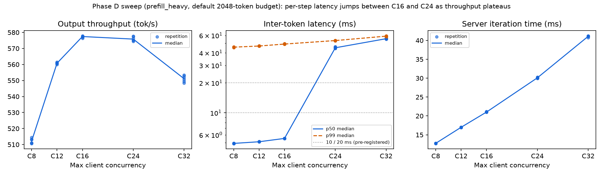
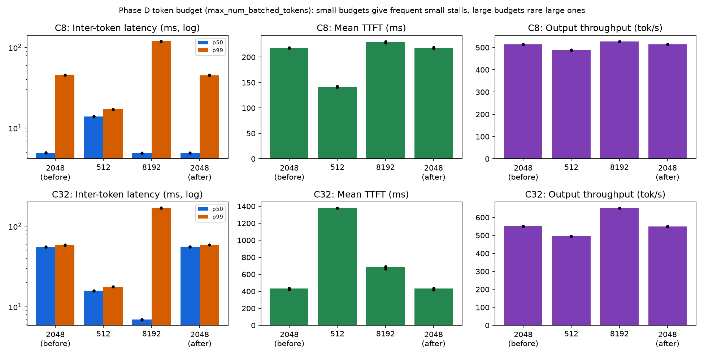

# BottleneckShift Milestone 3 Phase D: per-step sweep and token-budget intervention

## Result

**The per-step transition reproduces and is located.** At vLLM's default token budget,
median inter-token latency (ITL) stays near 5 ms up to 16 concurrent requests, then
jumps to 45 ms at C24 and 56 ms at C32. Over the same range, output throughput plateaus
(C16–C24) and the share of latency before the first token keeps falling. Every sweep
prediction about latency and throughput held, and C8, C16, and C32 reproduce Phase C
within about 1% on a different VM.

**The token budget changes the shape of per-step cost, not just its size.** The primary
budget prediction (ITL p50 and p99 both ordered 512 < 2048 < 8192 at C32) held for p99
but **not for p50**:

| Budget | Effect at C32 |
|---|---|
| 512 | Frequent small stalls: p50 ≈ p99 ≈ 16–18 ms, but TTFT is 3× higher and throughput 10% lower |
| 2048 (default) | Nearly every step carries about one full prompt: p50 ≈ p99 ≈ 55–59 ms, the worst median |
| 8192 | Rare large stalls: p50 7 ms but p99 169 ms, with 18% *more* throughput than the default |

So the default budget's apparent saturation is partly a scheduler setting. The
pre-registered falsifier was not triggered: ITL p50 at 512 is far below 2048.

**One planned measurement did not work as intended.** vLLM's per-iteration token
histogram credits a request's whole prompt to the iteration that emits its first token,
so it cannot show per-step chunk sizes. The pre-registered manipulation check that relied
on it cannot be evaluated as specified. The server logs confirm instead that each budget
took effect.

## Terms used in this report

| Term | Meaning |
|---|---|
| TTFT / E2E | Time to first token / end-to-end latency, from the client; "mean" values average over a run's requests |
| ITL p50 / p99 | Median / 99th percentile of the gaps between streamed tokens, from raw per-request arrays |
| TPOT | Time per output token after the first |
| C8 … C32 | Maximum client concurrency of 8 … 32 requests in flight |
| `prefill_heavy` | Workload of 2048 input / 32 output tokens, 100 prompts per run |
| Token budget | `max_num_batched_tokens`: the maximum tokens one engine step may process, i.e. decodes plus prompt chunks. vLLM's default on this GPU is 2048 |
| Engine step / iteration | One scheduler iteration of the vLLM engine; "output iteration" means one that produced tokens |
| Server iteration time | Benchmark duration / output iterations (column `server_step_ms`) |
| Iteration tokens | The `vllm:iteration_tokens_total` histogram; its semantics are explained in the interpretation section |
| Sweep / `sweep_cN` | Part 1: C8, C12, C16, C24, C32 at the default budget, run forward (ascending) and reverse |
| `budget-0512`, `budget-8192`, `budget-2048-before` / `-after` | Part 2 series at budgets 512, 8192, and 2048 (run before and after the others to bracket drift), each at C8 and C32 (`budget_c8`, `budget_c32`) |
| Pre-first-token share | Σ TTFT / Σ E2E over a run's requests |
| Manipulation check | A test that the intervention actually changed what it was meant to change |

Full definitions and defaults: [`docs/glossary.md`](../docs/glossary.md).

## Provenance and protocol

- **Session:** `milestone3d-20261006T022744Z`, October 6, 2026, 02:27–03:20 UTC: six
  series in pre-registered order.
- **Protocol:** the Phase D addendum in
  [`experiments/milestone3.md`](../experiments/milestone3.md), pre-registered by the
  merge of PR #18 at 2026-10-04 20:48:48 UTC, before any Phase D data. There were no
  amendments.
- **Commit:** `58a83a73d2659a004f241a4eb4d3ba6c01ef5af6`, with a clean worktree.
- **Host:** Hyperstack RTX A4000 (15,352 MiB), a new VM allocation, the same shape as
  Phases B and C. Driver 580.178.04 was already installed on the image. Software: vLLM
  0.29.0, PyTorch 2.13.0, transformers 5.18.0, Python 3.12.3.
- **Controls**, confirmed in each `server.log`:
  - model and tokenizer pinned to `7ae5576…`;
  - prefix caching off;
  - `--generation-config vllm`;
  - greedy sampling;
  - chunked prefill on;
  - three repetitions;
  - 15 s cooldowns;
  - 32-prompt warm-ups at every concurrency level.

  Each budget series logged its engine config with `'max_num_batched_tokens': 512`,
  `2048`, or `8192`. The sweep passed no budget, and its logs don't print the value. The
  sweep therefore ran at vLLM's default, which is 2048 on this GPU; the explicit
  2048-budget series match the sweep within 0.4%.

## Validation

`scripts/validate_results.py` passed for each series on the host right after it ran,
and again locally from the transferred archive. The archive SHA-256 was verified after
transfer.

| Check | Result |
|---|---|
| Measured requests | 5,400 (1,500 per sweep series, 600 per budget series) |
| Warm-up requests | 576 (26 warm-up runs: 32 prompts per concurrency level) |
| Failures, token lengths | Zero failures; exact 2048/32 tokens |
| Server count = prompts | Yes, every run (7,176 server requests, including warm-ups) |
| Telemetry max gap | 0.23 s GPU, 1.0 s CPU |
| Server logs | No `ERROR` lines; controls and budgets confirmed |

## Measurements

Medians across three repetitions, with the repetition range where it matters. Forward
and reverse sweeps agree within about 1% on every metric, so only the forward values are
shown, except where noted.

Figures are regenerated from the validated series; provenance and regeneration are in
[`reports/figures/README.md`](figures/README.md).

### Part 1 — concurrency sweep (default budget)

| C | Output tok/s | ITL p50 (ms) | ITL p99 (ms) | Mean TTFT (ms) | Mean E2E (ms) | Pre-1st share | Server queue / prefill / decode (ms) | Server iteration time (ms) |
|---|---:|---:|---:|---:|---:|---:|---:|---:|
| 8 | 513.2 | 4.92 | 45.2 | 218.6 | 486.9 | 0.449 | 60.4 / 117.1 / 269.8 | 12.7 |
| 12 | 561.2 | 5.12 | 46.9 | 252.9 | 665.8 | 0.380 | 82.5 / 125.9 / 414.3 | 17.0 |
| 16 | 577.5 | 5.53 | 49.1 | 304.1 | 862.6 | 0.353 | 120.7 / 132.0 / 560.3 | 21.0 |
| 24 | 575.0 (rev 577.4) | 45.80 (44.61–45.96) | 53.4 | 357.7 | 1302.3 | 0.274 | 146.2 / 144.7 / 947.4 | 30.3 |
| 32 | 549.4 (rev 552.8) | 55.59 | 59.0 | 433.4 | 1831.9 | 0.237 | 187.4 / 155.0 / 1401.6 | 41.1 |

*Throughput, ITL p50 and p99 (log scale, with the pre-registered 10 and 20 ms lines),
and server iteration time against concurrency, forward and reverse.*

### Part 2 — token budget

| Series | Cond. | Output tok/s | ITL p50 (ms) | ITL p99 (ms) | Mean TTFT (ms) | Mean E2E (ms) | Server queue / prefill / decode (ms) |
|---|---|---:|---:|---:|---:|---:|---:|
| budget-2048-before | C8 | 513.7 | 4.92 | 45.3 | 218.2 | 486.5 | 61.1 / 117.1 / 269.8 |
| budget-0512 | C8 | 488.1 | 13.95 | 17.1 | 141.7 | 517.3 | 35.8 / 85.8 / 378.1 |
| budget-8192 | C8 | 527.3 | 4.87 | 118.8 | 229.2 | 472.5 | 1.3 / 171.9 / 246.9 |
| budget-2048-after | C8 | 513.7 | 4.91 | 45.2 | 217.4 | 486.5 | 61.0 / 117.0 / 270.2 |
| budget-2048-before | C32 | 550.8 | 55.36 | 58.7 | 432.7 | 1827.1 | 185.1 / 154.6 / 1395.1 |
| budget-0512 | C32 | 496.2 | 15.80 | 17.8 | 1378.8 | 1843.9 | 1222.3 / 93.4 / 467.2 |
| budget-8192 | C32 | 652.5 | 6.94 | 168.7 | 686.1 | 1494.0 | 210.5 / 313.5 / 816.0 |
| budget-2048-after | C32 | 549.6 | 55.51 | 58.6 | 432.7 | 1830.9 | 189.4 / 154.3 / 1403.3 |

Repetition ranges are tight: for example, ITL p50 at budget-0512 C32 spans 15.77–15.81 ms,
and throughput at budget-8192 C32 spans 652.45–652.87 tok/s.

*ITL p50 and p99 (log scale), mean TTFT, and output throughput per budget, at C8 (top)
and C32 (bottom).*

## Predictions vs observed

### Part 1 — concurrency sweep

| # | Prediction | Observed | Verdict |
|---|---|---|---|
| 1 (primary) | ITL p50 < 10 ms at C8, C12, C16; > 20 ms at C24 or C32 | 4.9, 5.1, 5.5 ms, then 45.8 and 55.6 ms; both orders | **Confirmed.** The transition lies between C16 and C24 |
| 2 | Share of steps > 1024 tokens and mean server step time rise monotonically | Step time 12.7 → 17.0 → 21.0 → 30.3 → 41.1 ms. The "share" rises 0.20 → 0.70, but it measures iterations in which a prefill completed (see interpretation) | **Mixed:** step time confirmed; the share metric does not measure step size, so it is not counted as support |
| 3 | Throughput peaks at C12 or C16; C24 and C32 no more than 5% above the peak | Plateau at C16 (577.5) and C24 (575.0 / 577.4); C32 −5% | **Confirmed** |
| 4 | Pre-first-token share falls monotonically | 0.449 → 0.380 → 0.353 → 0.274 → 0.237 (both orders) | **Confirmed** |
| 5 | C8, C16, C32 reproduce Phase C within 5% (throughput, mean E2E) | Throughput −0.8%, −0.9%, −1.0%; mean E2E +0.6%, +0.9%, +1.1% | **Confirmed**, on a new VM allocation |

### Part 2 — token budget

| # | Prediction | Observed | Verdict |
|---|---|---|---|
| 6 | Manipulation check: no step exceeds the budget (via the iteration-token histogram) | Observations exceed every budget, because the histogram credits whole prompts at first token. Server logs confirm 512, 2048, and 8192 were applied | **Not evaluable as specified**; budgets were applied (log evidence) |
| 7 (primary) | At C32, ITL p50 and p99 ordered 512 < 2048 < 8192 | p50: 8192 (6.9) < 512 (15.8) < 2048 (55.4). p99: 17.8 < 58.7 < 168.7 | **Not confirmed for p50** (non-monotonic); **confirmed for p99** |
| 8 | At C32, mean TTFT 512 > 2048 ≥ 8192 | 1378.8 > 432.7, but 8192 is 686.1 | **Mixed:** 512 highest, but 8192 > 2048 |
| 9 | Budget effect on ITL p50 smaller at C8 than at C32 (\|8192 − 512\|) | 9.1 ms at C8, 8.9 ms at C32 | **Not confirmed** |
| 10 | At C32, 512 lowers throughput vs 2048 | 496.2 vs 550.8 (−9.9%) | **Confirmed** |
| 11 | 2048-after within 2% of 2048-before; 2048 matches the sweep default within 5% | Within 0.3% (E2E and throughput, C8 and C32); explicit 2048 vs default within 0.4% | **Confirmed** |

**Falsification criteria.** Prediction 6 failed, but on measurement grounds; the budget
itself was applied, which is what the criterion protects against. The specific falsifier
for the step-size explanation was that ITL p50 at C32 is not lower at 512 than at 2048.
It was not triggered: 15.8 vs 55.4 ms. Prediction 7 failed because of the 8192 arm, not
the 512 arm.

## Interpretation

- **What the iteration-token histogram measures (source-verified).**
  - In vLLM 0.29.0, `vllm:iteration_tokens_total` is observed once per output-producing
    iteration. The value is prompt tokens plus tokens generated, but the prompt tokens
    come from `PromptTokenStats.update_from_output`, which runs only while a request
    emits its first token, and it adds the request's full prompt length
    (`vllm/v1/metrics/stats.py`, `IterationStats.update_from_output`).
  - A 2048-token prompt computed over several chunked-prefill steps is therefore recorded
    as 2048+ tokens in one iteration, and as nothing in the earlier steps.
  - With 2048-token prompts, the shares over 512, 1024, and 2048 are identical: they are
    the share of iterations in which some request completed its prefill. The share over
    8192 is the share in which at least four did (0.12 at budget 8192, C32).
  - The pre-registered step-size metric was the wrong instrument. Server iteration time
    remains valid.
- **The budget trades stall frequency against stall size (observation, not
  pre-registered).**
  - **512:** a prompt chunk of at most 480–504 tokens rides along with the decodes in
    every step, so every step is moderately slow (p50 ≈ p99 ≈ 16–18 ms). Each 2048-token
    prompt needs five steps, so prefill capacity per step falls and requests wait: at
    C32, queue time rises to 1.2 s and TTFT triples.
  - **2048 (the default):** with 2048-token prompts and 32 requests, nearly every step
    carries about one prompt's worth of prefill, so p50 ≈ p99 ≈ 55–59 ms. This is the
    worst median.
  - **8192:** several prompts are batched into rare, very large steps. Most steps are
    pure decode (p50 6.9 ms), but those large steps produce a 169 ms p99 and push TTFT
    above the 2048 level. Throughput rises 18%, consistent with fewer, more efficient
    large steps.
- **What this means for the Phase C finding.** The per-step shift is real and repeatable,
  and it is set by how the scheduler packs prompt work into generation steps. It is not a
  fixed hardware ceiling. With a larger budget, throughput at C32 exceeds the default's
  plateau by 18%. "Saturation" in Phases C and D is therefore partly a property of the
  default `max_num_batched_tokens = 2048` on this GPU, which happens to equal the prompt
  length.
- **Median vs tail.** No single latency statistic ranks the budgets. By ITL p50 the
  ranking is 8192 < 512 < 2048; by p99 it is 512 < 2048 < 8192; by TTFT it is
  2048 < 8192 < 512. Choosing a budget is a choice of which user-visible metric to
  protect.
- **Client–server gap.** The gap between client and server TTFT grows with concurrency
  (4.7 ms at C8 to 15.7 ms at C32), as in Phase C, and is largest at budget 8192 C32
  (20.7 ms). It remains unattributed.

## Related evidence from published research and engineering sources

Sources were checked on October 5, 2026; citations [P1], [P2], [R1], and [B4] are
verified in the [Phase C report](milestone3-20261003T201214Z-phase-c.md).

| Finding | Verdict | Evidence |
|---|---|---|
| Smaller budgets give lower, steadier ITL | **Supports (p99), qualifies (p50)** | vLLM's own guidance: "Smaller values (e.g., 2048) achieve better ITL because there are fewer prefills slowing down decodes" [B4]. Sarathi-Serve: "iterations with fewer prefill tokens have lower latency" [P1 §4.3]. This study qualifies it: the 8192 budget gives the *lowest* median ITL, because it concentrates prefill work into rare steps. |
| Smaller budgets raise TTFT | **Supports** | Chunked prefill "trades TTFT for TPOT" [P2 §2.2]; "chunked-prefills-only increases TTFT" [P1 §5.4.2]. 512 raises mean TTFT 3× at C32. |
| Larger budgets improve TTFT | **Opposes, in this setup** | vLLM: "Higher values achieve better time to first token (TTFT) as you can process more prefill tokens in a batch" [B4]. Here 8192 gives a higher mean TTFT than 2048 at C8 and C32, plausibly because each large step makes waiting prefills and decodes slower. |
| Larger budgets improve throughput for small models | **Supports** | vLLM: "For optimal throughput, we recommend setting max_num_batched_tokens > 8192 especially for smaller models on large GPUs" [B4]. 8192 gives +18% at C32 and +2.6% at C8 on this 0.5B model. |
| Averages and single percentiles hide per-step behavior | **Supports** | TPOT "hides jitters in token generation" [R1 §3.1]. Here p50 and p99 rank the budgets in opposite orders. |
| The vLLM iteration-token metric attributes prompts at first token | **Source-verified** | `vllm/v1/metrics/stats.py` at v0.29.0 (`IterationStats.update_from_output`, `PromptTokenStats.update_from_output`): https://github.com/vllm-project/vllm/blob/v0.29.0/vllm/v1/metrics/stats.py |

## Limitations

- **Per-step chunk sizes were not observed.** The step-size mechanism is inferred from
  ITL distributions, server iteration time, and the budget's effects. Measuring it
  directly would need per-step scheduler output, e.g. vLLM debug logging or a custom
  stat logger.
- **Narrow conditions.** One prompt length (2048, equal to the default budget), one
  model, one GPU, closed-loop load, and three budget levels. Whether the default is the
  worst median case depends on the ratio of prompt length to budget, which was not
  varied.
- **Few repetitions.** Each budget series has one order (C8 then C32) and three
  repetitions. The bracketing 2048 series argue against drift.
- **Sampler overhead** is still unmeasured.

## Execution notes

- The lean run plan was used: `setup.sh`, `run.sh`, `archive.sh`. The image already had
  driver 580, so `setup.sh` did not reboot. All six series validated on the first
  attempt; nothing failed, and nothing was rerun or spliced.
- The 512 budget was accepted by vLLM; the run plan had flagged that as an unverified
  risk.
- **Analysis-side fix in this change:** the glossary, `prometheus.py`, and `phases.py`
  now describe the iteration-token columns correctly, as shares of iterations, not
  tokens per step.

## Recommended next step

- **Report the budget trade-off as Milestone 3's main mechanism result.** It is the
  clearest bottleneck-shift evidence in the study: a scheduler setting moves the
  dominant per-step cost between frequent small stalls and rare large ones.
- **A follow-up that would close the measurement gap:** pre-register a test that varies
  prompt length relative to the budget (for example, 1024 and 4096 tokens at budget
  2048), using per-step scheduler output rather than the iteration-token histogram.
  This fits Milestone 5 (workload shape).
- **Milestone 3 status:** Phases B–D are complete. Mark Milestone 3 complete.

## Artifact record

- **Archive:** `milestone3d-20261006T022744Z.tar.gz` (3.2 MB)
- **SHA-256:** `99994da18409974b915dc9fae47120a2a87ece12bbccbacb57dbbf95d209a98b`
- **Contents:** six series (raw `requests.json`, manifests, server logs, metrics
  scrapes, `gpu.csv`, `cpu.txt`, per-series `validation.json`), plus the host scripts
  and logs.
- **Committed figures:** `reports/figures/milestone3-phase-d-{sweep,budget}.png`,
  regenerated from this archive by
  `analysis/milestone3_figures.py <runs> milestone3d-20261006T022744Z --phase d`.
- **Before publishing:** remove identifying data. `cpu.txt` contains the hostname, and
  the manifests contain the GPU UUID and host paths. The archive is retained outside
  this repository.
